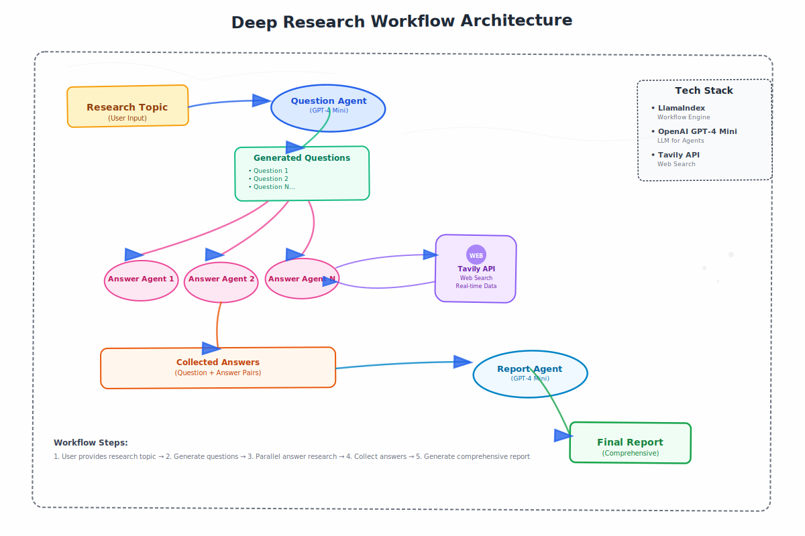

# 🔬 Deep Research Multi AI Agent

A multi-agent deep research system. This application provides a modern, user-friendly way to conduct comprehensive research using AI agents.

## 🎬 Demo Video


*Watch the app in action! See how it generates research questions, searches the web, and creates comprehensive reports in just minutes.*

**Note:** Click the video link above to watch the demo. GitHub will display the video directly in the browser.

## 🏗️ Architecture Diagram



*System architecture showing the flow from user input to final research report generation.*

## ✨ Features

- **Beautiful UI**: Modern peachy color scheme with smooth animations
- **Markdown Reports**: Professional formatting with headers, lists, and code blocks
- **API Key Management**: Secure input for OpenAI and Tavily API keys
- **Multi-agent System**: Leverages question generation, web search, and report synthesis
- **Responsive Design**: Works perfectly on desktop and mobile devices
- **Progress Tracking**: Real-time updates showing research status
- **Toast Notifications**: Clear feedback for all user actions

## 🚀 Quick Start

### 1. Clone the Repository

```bash
git clone https://github.com/syedmammar123/Deep-Research-multi-agent-system.git
cd Deep-Research-multi-agent-system
```

### 2. Install Dependencies

```bash
pip install -r requirements.txt
```

### 3. Get API Keys

You'll need two API keys:

- **OpenAI API Key**: Get it from [OpenAI Platform](https://platform.openai.com/api-keys)
- **Tavily API Key**: Get it from [Tavily](https://tavily.com/)

### 4. Run the Application

```bash
python app.py
```

### 5. Open Your Browser

Navigate to `http://localhost:5000` and start researching!

## 🎯 How to Use

1. **Configure API Keys**: Enter your OpenAI and Tavily API keys in the secure input fields
2. **Enter Research Topic**: Type your research question or topic (e.g., "Temperature of karachi on 24th june 2025")
3. **Watch the Magic**: Observe as the AI agents:
   - Generate relevant research questions
   - Search the web for information
   - Synthesize a comprehensive report
4. **Get Your Report**: View the final research report with all findings in beautiful markdown format

## 🏗️ Architecture

The application uses a simplified, efficient workflow:

- **Question Generation**: Creates 5-7 specific research questions
- **Web Search**: Uses Tavily API to find current information
- **Answer Synthesis**: Combines search results with AI analysis
- **Report Creation**: Generates professional markdown reports

## 🎨 UI Features

- **Peachy Color Scheme**: Warm, inviting colors that reduce eye strain
- **Modern Typography**: Clean Inter font for excellent readability
- **Smooth Animations**: Engaging transitions and loading states
- **Markdown Rendering**: Professional report formatting
- **Responsive Design**: Optimized for all screen sizes
- **Toast Notifications**: Clear feedback with proper contrast

## 🔧 Technical Details

- **Backend**: Flask web framework
- **Frontend**: Vanilla JavaScript with modern CSS
- **AI Integration**: OpenAI GPT-4o-mini for intelligent responses
- **Web Search**: Tavily API for comprehensive web research
- **Markdown**: Marked.js for beautiful report rendering
- **Styling**: Custom CSS with peachy color scheme

## 📁 Project Structure

```
Deep-Research-multi-agent-system/
├── app.py                 # Main Flask application
├── requirements.txt      # Python dependencies
├── README.md            # This file
├── templates/
│   └── index.html       # Main HTML template
└── static/
    ├── style.css        # Beautiful CSS styles
    └── script.js        # Interactive JavaScript
```

## 🛠️ Development

To modify or extend the application:

1. **Styling**: Edit `static/style.css` for visual changes
2. **Functionality**: Modify `static/script.js` for frontend behavior
3. **Backend Logic**: Update `app.py` for server-side changes
4. **Research System**: Modify the research workflow in `app.py`

## 🔒 Security Notes

- API keys are stored in memory only (not persisted)
- Input validation prevents malicious requests
- No sensitive data is logged or stored

## 🐛 Troubleshooting

**Common Issues:**

1. **API Key Errors**: Ensure both OpenAI and Tavily keys are valid
2. **Connection Issues**: Check if the server is running on port 5000
3. **Research Timeouts**: Complex topics may take 3-4 minutes to process
4. **Import Errors**: Make sure all dependencies are installed correctly

**Getting Help:**
- Check the browser console for JavaScript errors
- Review the Flask server logs for backend issues
- Ensure all dependencies are properly installed with `pip install -r requirements.txt`

## 📊 Performance

- **Research Time**: 3-4 minutes for comprehensive reports
- **API Usage**: Optimized to minimize costs
- **Memory Usage**: Lightweight, efficient processing
- **Browser Compatibility**: Works on all modern browsers

## 🎯 Use Cases

Perfect for:
- **Academic Research**: Quick literature reviews and topic analysis
- **Business Intelligence**: Market research and competitive analysis
- **Content Creation**: Research for articles and reports
- **Learning**: Understanding complex topics quickly
- **Presentations**: Gathering comprehensive information for talks

## 📝 License

This project is open source and available under the MIT License.

## 🤝 Contributing

Contributions are welcome! Please feel free to submit a Pull Request.

## 📞 Support

If you have any questions or issues, please open an issue on GitHub.

---

**Happy Researching! 🔬✨** 