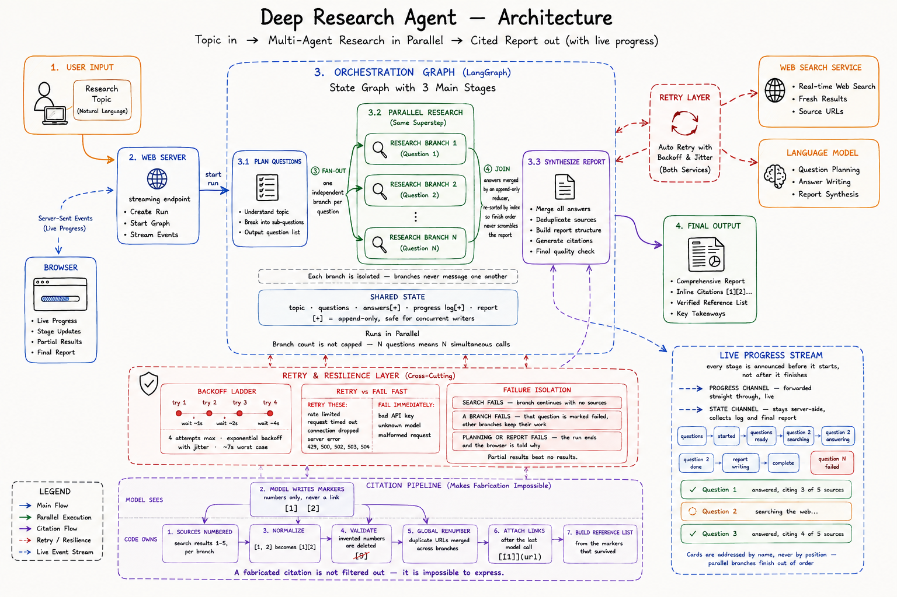

# Deep Research Agent

A FastAPI app that turns a research topic into a cited markdown report. It plans its own questions, researches them in parallel against live web search, and writes a report where every claim links back to the page it came from.


## What it does

Give it a topic. It then:

1. Asks the model for 2 to 3 specific questions worth investigating.
2. Researches every question **at the same time**, one concurrent branch each, using Tavily web search.
3. Combines the answers into a report with an executive summary, key findings, analysis, and conclusion.

Progress streams to the browser live, so you watch each question move through searching, answering, and done rather than staring at a spinner for three minutes.

## Cited by construction

The model never writes a URL. It only ever sees a numbered list of search results and writes markers like `[1]` and `[2]` into its prose. Every link in the finished report is put back by code, from Tavily's own response, which means a fabricated citation is not something the app detects after the fact: the model has no way to express one.

Clicking any `[n]` in the report opens that source in a new tab, and the report ends with a matching References list.

Getting this right needs a few things that are easy to miss:

* Each question searches independently and numbers its own results from 1, so `[1]` means different pages in different answers. All sources are deduplicated by URL into one global numbering before the report is written.
* Markers become links only *after* the report is generated. A model that can see URLs will eventually truncate one.
* Any marker naming a source that does not exist is stripped, and the References list is built from the markers that survive, so the two halves cannot disagree.

## Architecture



Orchestration is a [LangGraph](https://langchain-ai.github.io/langgraph/) `StateGraph`:

```
generate_questions
      |
      v  Send() fan-out, one branch per question
answer_question   (search, then answer with citations)
      |
      v  branches rejoin through the `answers` reducer
write_report
```

The fan-out is real concurrency, not a loop: LangGraph runs the branches on a thread pool, and since both the Tavily and Groq calls are blocking network I/O they overlap in wall clock time. Branches finish out of order, so each answer carries its question index and is sorted back into place before the report is written.

```
app.py                FastAPI routes and the SSE endpoint. Web layer only.
research/
  config.py           env loading, fail fast key validation, the shared LLM client
  resilience.py       tenacity retry policies for Groq and Tavily
  state.py            graph state and QAResult
  citations.py        source registry, marker remapping, references
  search.py           Tavily search
  events.py           progress event builders and SSE framing
  nodes.py            the graph nodes
  graph.py            graph wiring
templates/index.html  markup
static/css/app.css    styling
static/js/app.js      frontend logic
```

**Resilience.** Every Groq and Tavily call retries with exponential backoff and jitter on rate limits, timeouts, and 5xx, and fails fast on anything a retry cannot fix, such as a bad key or an unknown model. A branch that still fails is caught in place: the run finishes with that one section missing instead of losing the other two.

**Streaming.** `POST /start_research` is a Server Sent Events stream, not a JSON endpoint. The frontend reads it with `fetch` and a stream reader rather than `EventSource`, which is GET only and auto reconnects, and would silently restart a three minute run.

## Setup

```bash
git clone https://github.com/syedmammar123/Deep-Research-multi-agent-system.git
cd Deep-Research-multi-agent-system
pip install -r requirements.txt
```

Copy `.env.example` to `.env` and fill in two keys:

* `GROQ_API_KEY` from [Groq](https://console.groq.com/keys)
* `TVLY_API_KEY` from [Tavily](https://tavily.com/)

`GROQ_MODEL` is optional and defaults to `openai/gpt-oss-20b`. Both keys are validated at import, so a bad `.env` fails at startup instead of several minutes into a run.

```bash
python app.py                              # or: uvicorn app:app --port 5000
```

Then open `http://localhost:5000`. A full report takes roughly 3 to 4 minutes.

## Tech

FastAPI, uvicorn, LangGraph, Groq, Tavily, tenacity, and vanilla JavaScript with marked.js for rendering. No frontend build step.

## Notes

`Deep_Research_multi_agent_system.ipynb` is the original prototype, built on LlamaIndex workflows with OpenAI and three distinct agents. The app has since moved to LangGraph and Groq. The notebook is kept as a reference for the multi agent features the app still lacks, namely distinct agent personas and a per question tool loop.
